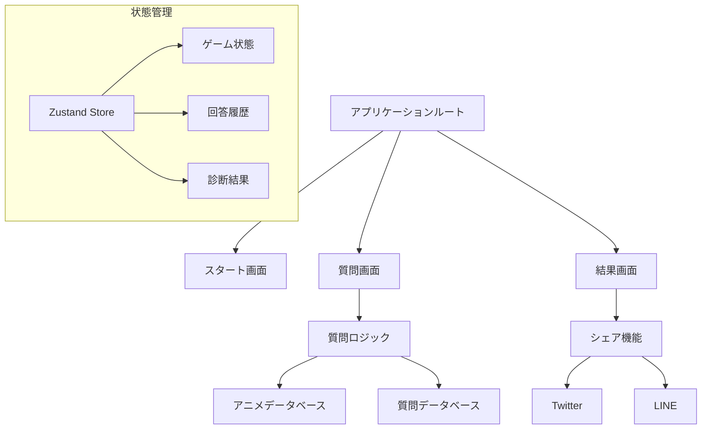

# なろう系アニメ診断アプリ 設計書

## 概要
このアプリケーションは、ユーザーがイメージしている「なろう系アニメ」を質問形式で推測するWebアプリケーションです。フロントエンドのみで完結する設計となっています。

## システム要件

### 基本機能
- ユーザーは質問に「はい」「いいえ」「わからない」で回答
- 20-30問程度の質問でアニメを推測
- 結果のSNSシェア機能（Twitter、LINE）

### 技術スタック
- React 18.x
- Ant Design 5.x
- Zustand（状態管理）
- Create React App

## システム構成図



## データ構造

### アニメデータ
```typescript
interface Anime {
  id: string;
  title: string;
  imageUrl: string;
  description: string;
  attributes: {
    isekai: boolean;
    cheat_ability: boolean;
    harem: boolean;
    rpg_like: boolean;
    weak_to_strong: boolean;
    revenge: boolean;
    dragon: boolean;
    game_world: boolean;
    summoned: boolean;
    magic_school: boolean;
  };
}
```

### 質問データ
```typescript
interface Question {
  id: string;
  text: string;
  attribute: keyof Anime['attributes'];
  weight: number;
}
```

## 実装フェーズ

### フェーズ1: 基本機能実装（2-3日）
- プロジェクトセットアップ
- データ構造の実装
- 基本UIコンポーネントの作成
- 質問ロジックの実装

### フェーズ2: データ投入（1-2日）
- 10アニメの基本データ作成
- 質問データベースの作成
- データのバリデーション実装

### フェーズ3: UI/UX改善（2日）
- アニメーション実装
- レスポンシブデザイン対応
- エラーハンドリング

### フェーズ4: シェア機能（1日）
- SNSシェアボタン実装
- シェアテキスト生成機能
- OGP対応

## ディレクトリ構造
```
src/
├── components/
│   ├── game/
│   │   ├── StartScreen.tsx
│   │   ├── QuestionScreen.tsx
│   │   └── ResultScreen.tsx
│   ├── shared/
│   │   ├── Button.tsx
│   │   ├── ProgressBar.tsx
│   │   └── ShareButtons.tsx
│   └── layout/
│       └── GameLayout.tsx
├── store/
│   └── gameStore.ts
├── data/
│   ├── animes.json
│   └── questions.json
└── utils/
    ├── questionSelector.ts
    ├── candidateFilter.ts
    └── shareHelpers.ts
```

## 主要アルゴリズム

### 質問選択アルゴリズム
```typescript
const selectNextQuestion = (candidates: Anime[], answers: Record<string, string>): Question => {
  const remainingQuestions = getUnaskedQuestions(answers);
  
  return remainingQuestions
    .map(question => ({
      question,
      score: calculateInformationGain(candidates, question)
    }))
    .sort((a, b) => b.score - a.score)[0].question;
};
```

### シェア機能
```typescript
const shareHelpers = {
  generateShareText: (result: GameResult) => {
    return `私がイメージしていたなろう系アニメは「${result.anime.title}」でした！\n#なろう系アニメ診断\n`;
  },
  
  shareToTwitter: (text: string) => {
    const url = `https://twitter.com/intent/tweet?text=${encodeURIComponent(text)}`;
    window.open(url, '_blank');
  },
  
  shareToLine: (text: string) => {
    const url = `https://line.me/R/msg/text/?${encodeURIComponent(text)}`;
    window.open(url, '_blank');
  }
};
```

## パフォーマンス最適化

### メモ化戦略
- React.memoの活用
- useMemoによる計算の最適化
- 効率的なデータ構造の使用

### レンダリング最適化
- コンポーネントの適切な分割
- 状態更新の最適化
- 不要な再レンダリングの防止

## 今後の拡張性
- アニメデータベースの拡充
- 新しい属性の追加
- UIテーマのカスタマイズ対応